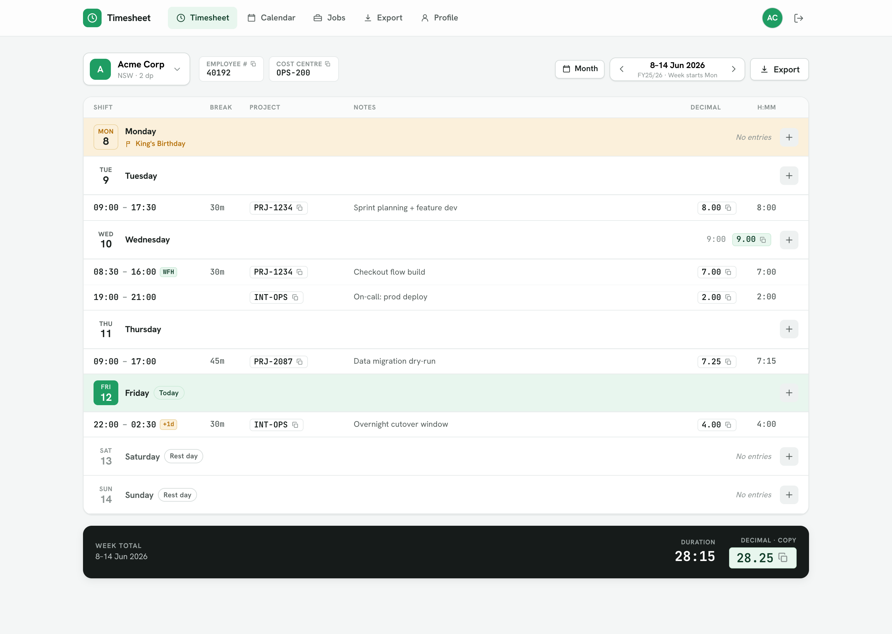
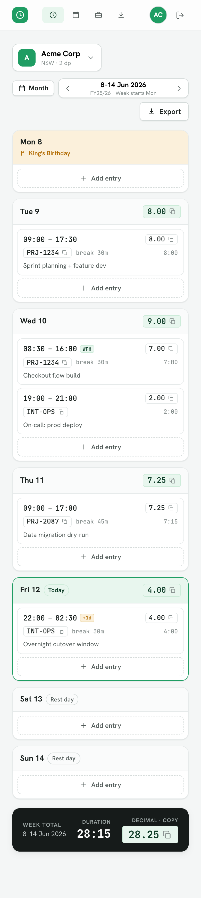
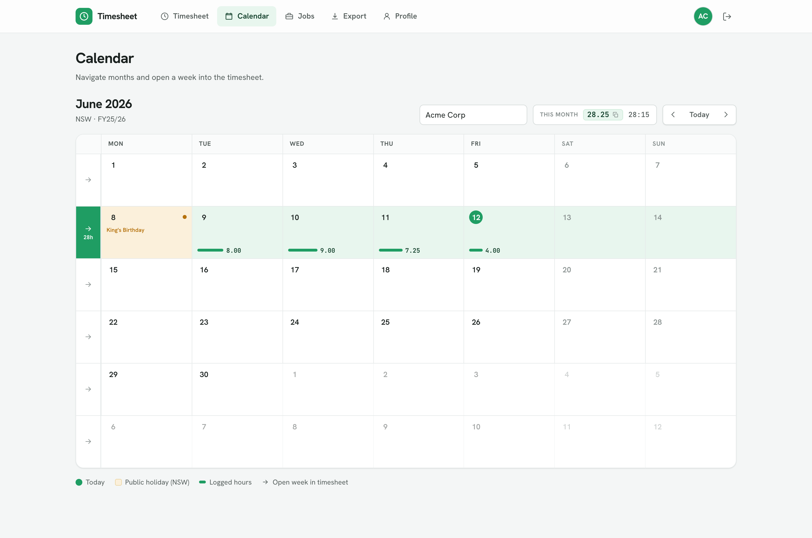
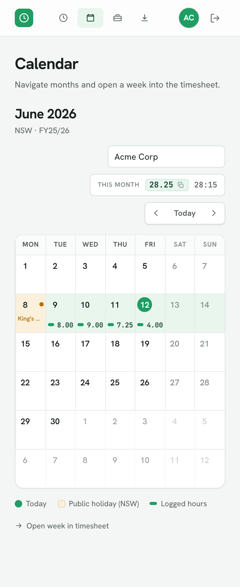
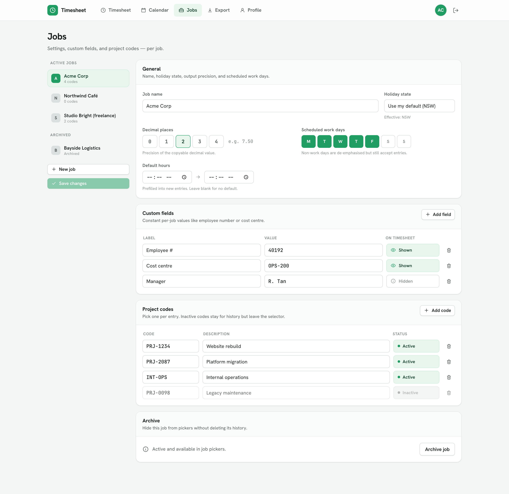
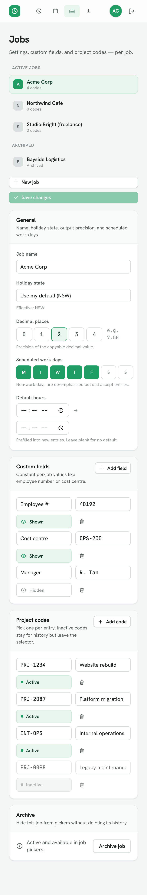
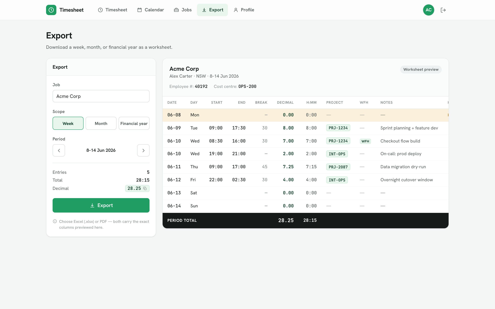
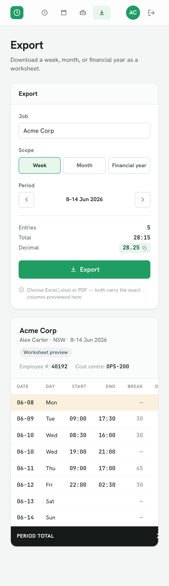
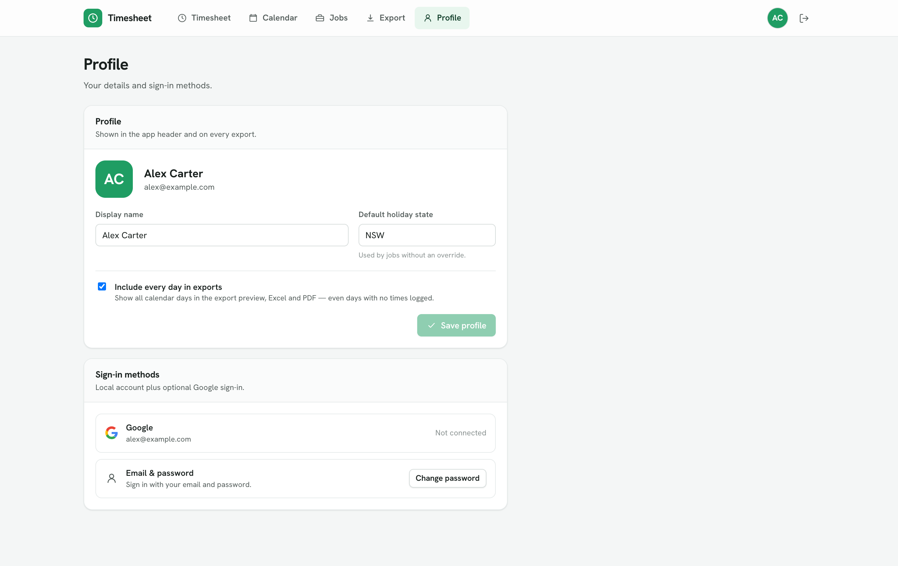
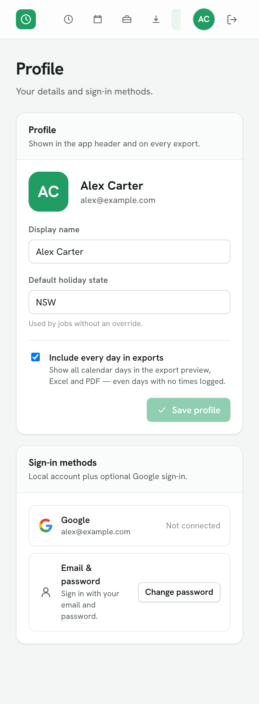

# Timesheet Tracker

A simple, multi-user **Australian timesheet** web app. Record shifts and turn them into
clean, **copyable decimal hours** + an `h:mm` duration to paste into payroll. Time tracking
only — no pay/penalty/award calculation.

Built with **.NET 10 · Blazor Web App (Interactive Server) · EF Core + PostgreSQL · ASP.NET Identity**.

## Screenshots

| | Desktop | Mobile |
|---|---|---|
| **Weekly timesheet** |  |  |
| **Calendar** |  |  |
| **Jobs editor** |  |  |
| **Export** |  |  |
| **Profile** |  |  |

## Features

- **Weekly grid** (Mon→Sun) with multiple entries per day, public-holiday flags (by state),
  work-day vs rest-day emphasis, and shifts that **cross midnight** (`+1d`).
- **One-click copy** of decimal hours (precision configurable per job) and shown custom fields
  (e.g. employee number).
- **Per-user jobs**, each with custom fields, project codes, holiday-state override, decimal
  places, and scheduled work days.
- **Month calendar** with holiday dots + logged-hour bars; open any week into the timesheet.
- **Excel export** (`.xlsx`) for a week, month, or financial year (1 Jul – 30 Jun).
- **Responsive** — the weekly grid collapses to stacked day cards on phones.
- **Google sign-in** + local accounts (ASP.NET Identity).

## Project structure

```
src/DataModel/   EF Core entities, DbContext, migrations, domain services, seed data
src/Web/         Blazor Web App (components, screens, data service, auth wiring)
tests/DataModel.Tests/   NUnit + Verify: calc/holiday/export logic, EF model, user-scoping
tests/Web.Tests/         bUnit + Verify.Bunit: component snapshots + per-screen render tests
```

## Run locally

By default in **Development** the app uses an in-memory database seeded with a sample week
(`SeedData`), so it runs with **no PostgreSQL required**:

```bash
dotnet run --project src/Web
# → http://localhost:5199
```

To run against PostgreSQL, set `UseInMemoryDatabase=false` and a connection string
(`ConnectionStrings:Default`) via environment/user-secrets, then apply migrations:

```bash
dotnet ef database update --project src/DataModel
```

## Test

```bash
dotnet test TimesheetTracker.slnx
```

The Testcontainers-based PostgreSQL integration test is marked `[Explicit]` (requires Docker);
all other tests run against EF InMemory. CI (`.github/workflows/ci.yml`) builds and runs the
suite on every push and pull request.

## Security & conventions

- **Central package management** (`Directory.Packages.props`); `.editorconfig` shared with the
  other JABTech projects; entities derive from `BaseEntity` with nested EF configurations.
- **Per-user query filters** on every owned entity (Job/TimeEntry/JobCustomField/ProjectCode)
  scope all reads to the signed-in user — defence in depth against cross-user (IDOR) access.
- **EF Core parameterises all queries** (no raw SQL).
- **Identity** enforces a 12-char password policy, lockout, unique email, and confirmed accounts.
- HTTPS redirection + HSTS in production; antiforgery enabled; secrets via environment /
  user-secrets (never committed).
