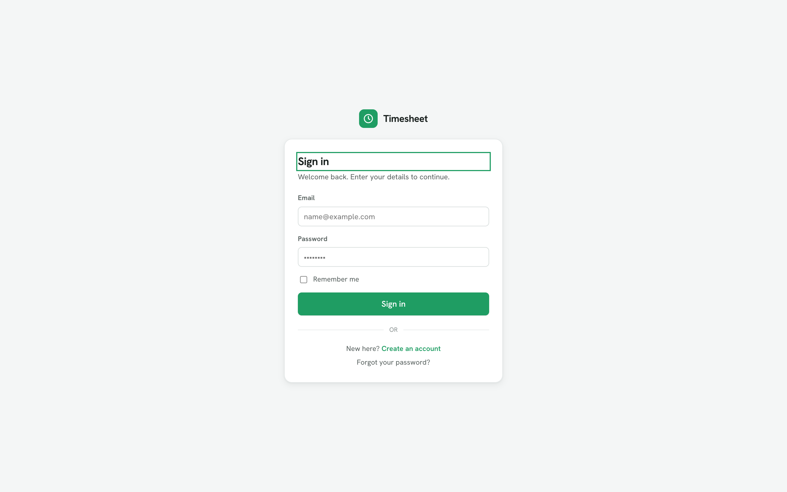
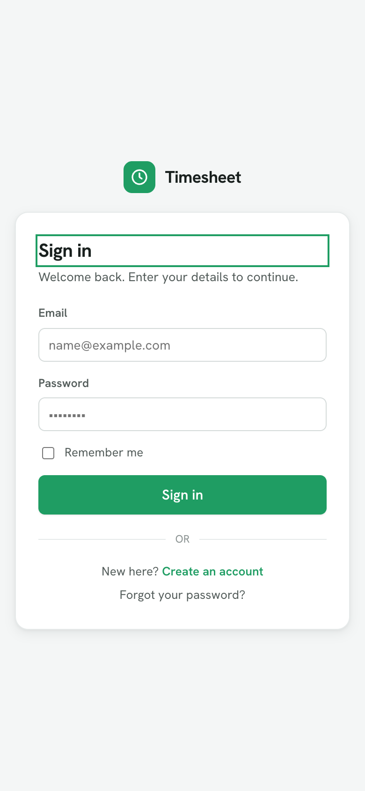
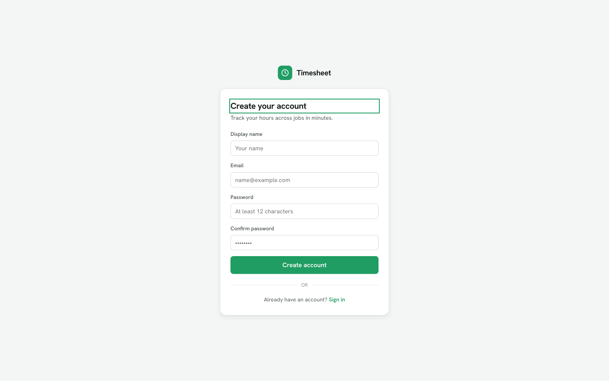
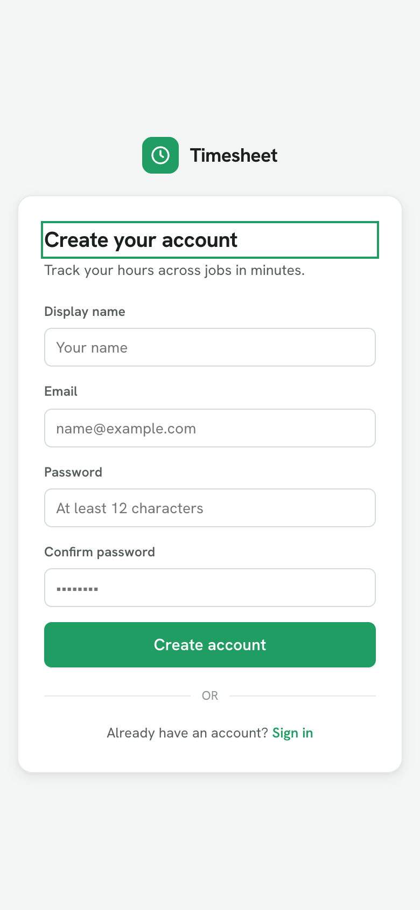

# Timesheet Tracker

A simple, multi-user **Australian timesheet** web app. Record shifts and turn them into
clean, **copyable decimal hours** + an `h:mm` duration to paste into payroll. Time tracking
only — no pay/penalty/award calculation.

Built with **.NET 10 · Blazor Web App (Interactive Server) · EF Core + PostgreSQL · ASP.NET Identity**.

**🔗 Live demo: <https://timesheet.jabtech.com.au/>**

## Screenshots

| | Desktop | Mobile |
|---|---|---|
| **Sign in** |  |  |
| **Register** |  |  |
| **Weekly timesheet** |  |  |
| **Calendar** |  |  |
| **Jobs editor** |  |  |
| **Export** |  |  |
| **Profile** |  |  |

## Features

- **Weekly grid** (Mon→Sun) with multiple entries per day, public-holiday flags (by state),
  work-day vs rest-day emphasis, and shifts that **cross midnight** (`+1d`).
- **One-click copy** of decimal hours (precision configurable per job) and shown custom fields
  (e.g. employee number).
- **Per-user jobs**, each with custom fields, project codes, holiday-state override, decimal
  places, and scheduled work days.
- **Month calendar** with holiday dots + logged-hour bars; open any week into the timesheet.
- **Excel export** (`.xlsx`) for a week, month, or financial year (1 Jul – 30 Jun).
- **Responsive** — the weekly grid collapses to stacked day cards on phones.
- **Google sign-in** + local accounts (ASP.NET Identity).

## Project structure

```
src/DataModel/   EF Core entities, DbContext, migrations, domain services, seed data
src/Web/         Blazor Web App (components, screens, data service, auth wiring)
tests/DataModel.Tests/   NUnit + Verify: calc/holiday/export logic, EF model, user-scoping
tests/Web.Tests/         bUnit + Verify.Bunit: component snapshots + per-screen render tests
```

## Run locally

By default in **Development** the app uses an in-memory database seeded with a sample week
(`SeedData`), so it runs with **no PostgreSQL required**:

```bash
dotnet run --project src/Web
# → http://localhost:5199
```

The app requires sign-in. In Development the seed creates a ready-to-use account:

- **Email:** `alex@example.com`  **Password:** `TimesheetDev123!`

…or register a new account (it starts empty — create a job to begin). Google sign-in appears
once `Authentication:Google:ClientId`/`ClientSecret` are configured.

To run against **PostgreSQL**, set `UseInMemoryDatabase=false` and the connection string
(`ConnectionStrings:Default`) via environment/user-secrets, then apply migrations:

```bash
dotnet ef database update --project src/DataModel
```

## Test

```bash
dotnet test TimesheetTracker.slnx
```

The Testcontainers-based PostgreSQL integration test is marked `[Explicit]` (requires Docker);
all other tests run against EF InMemory. CI (`.github/workflows/ci.yml`) builds and runs the
suite on every push and pull request.

## Deploy (Docker / Portainer)

Build the image and push it to your registry, then deploy the stack in Portainer:

```bash
docker build -f docker/Dockerfile.web -t gitea.jabtech.com.au/<user>/timesheettracker-web:latest .
docker push gitea.jabtech.com.au/<user>/timesheettracker-web:latest
```

The Portainer stack + Ansible automation lives in the **TrueNas** project
(`stacks/timesheet/docker-compose.yml`, `env/timesheet.env`, registered in
`stacks_deploy.yml`). The only values to fill in `env/timesheet.env` are the **Postgres
credentials** and the **Google client secret** — the Google **client id**, DB host/name, and
networks are already set. See `stacks/timesheet/DEPLOY.md` there for the deploy checklist.

Configuration is env-var driven (the deploy fills these):

| Variable | Purpose |
|---|---|
| `DATABASE_CONNECTION_STRING` | Npgsql connection string (Postgres) |
| `GOOGLE_CLIENT_ID_WEB` | Google OAuth client id (baked into the compose) |
| `GOOGLE_CLIENT_SECRET` | Google OAuth client secret (`.env`) |
| `DATA_PROTECTION_KEYS_PATH` | Where auth/antiforgery keys persist (volume) |

On startup the app **applies EF Core migrations automatically** and serves a liveness probe at
`/health/live`. It runs as a non-root user on port `8080`, persists Data Protection keys to a
volume (so logins survive restarts), and honours `X-Forwarded-Proto/For` from the reverse proxy
(cloudflared / NPM) so OAuth redirects and Secure cookies work behind TLS termination.

> **Google OAuth:** add your production redirect URI `https://<your-domain>/signin-google` to the
> authorized redirect URIs for this client in the Google Cloud console.

## Security & conventions

- **Central package management** (`Directory.Packages.props`); `.editorconfig` shared with the
  other JABTech projects; entities derive from `BaseEntity` with nested EF configurations.
- **Per-user query filters** on every owned entity (Job/TimeEntry/JobCustomField/ProjectCode)
  scope all reads to the signed-in user — defence in depth against cross-user (IDOR) access.
- **EF Core parameterises all queries** (no raw SQL).
- **Authentication** is real ASP.NET Core Identity (cookie auth) with register/login/logout and
  Google external login; app pages require sign-in (`[Authorize]`), and `ICurrentUser` resolves
  the signed-in user so the query filters scope data to them.
- **Identity** enforces a 12-char password policy, lockout, and unique email.
- **Security headers** on every response: a Content-Security-Policy with a **per-request
  script nonce** (scripts are `'self'` + nonce only; styles allow inline attributes per the
  design system), `X-Content-Type-Options`, `X-Frame-Options`/`frame-ancestors`,
  `Referrer-Policy`, `Permissions-Policy`, and `Cross-Origin-Opener-Policy`.
- **Response caching** via [Delta](https://github.com/SimonCropp/Delta) — ETag/304s keyed on
  the database's last transaction id, suffixed per-user (Postgres only; skipped for the Blazor
  circuit, auth pages, and health probe).
- HTTPS redirection + HSTS in production; antiforgery enabled; secrets via environment /
  user-secrets (never committed).

> **Before production:** email confirmation is currently off (`RequireConfirmedAccount = false`)
> because no email sender is wired. Plug in a real `IEmailSender<AppUser>` (e.g. AWS SES) and
> re-enable confirmation.
