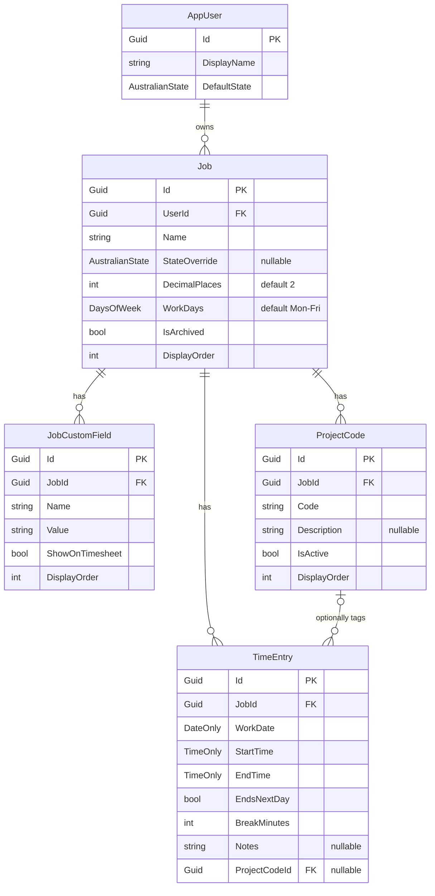

# Timesheet Tracker — Design Spec

- **Date:** 2026-06-09
- **Status:** Approved (data model + architecture) — ready for implementation planning & design handoff
- **Author:** JABTech + Claude
- **Audience:** This document is the handoff for *claude design* (UI/visual design) and for the implementation plan. It focuses on the **data model entities** and the **app overview**.

---

## 1. Goal

A **simple, multi-user web** timesheet system to accurately track worked hours and feed them into external payroll/HR systems. The user records shifts; the app turns them into clean, **copyable decimal hours** and an `h:mm` duration. It is **time tracking only** — it does **not** calculate pay, penalty rates, or award entitlements (the downstream system does that).

It follows sensible Australian timesheet conventions: week starts **Monday**, financial year is **1 Jul – 30 Jun**, and **public holidays** are surfaced (by state) but never block entry.

### Success criteria
- Enter start/end/break/notes for any day in a **weekly grid**, with calendar navigation forward/back through months.
- Multiple entries per day; shifts may **cross midnight**.
- Each shift shows a **decimal value** (precision configurable per job) and an **`h:mm`** duration, with one-click **copy** of the decimal.
- Per-user **jobs**, each with its own settings, custom attributes, and project codes.
- **Excel export** for a week, a month, and a financial year.
- **Mobile-friendly / responsive** — usable on a phone.

---

## 2. Users & authentication

- **Multi-user.** Each user owns their own jobs and time entries; data is never shared between users.
- **ASP.NET Core Identity** with `IdentityDbContext<AppUser, IdentityRole<Guid>, Guid>` (matches the VendingMachineTracker convention).
- **Google sign-in** via `Microsoft.AspNetCore.Authentication.Google` (external login), alongside standard local email/password accounts.
- All queries are scoped to the authenticated user.

---

## 3. Architecture

**Blazor Web App, Interactive Server render mode — single deployable, no separate API.**

Rationale: a DB-backed CRUD app with live grid editing. Components call EF Core-backed services directly; no API/DTO/token layer needed. (A separate API would only be justified by an offline or native client, which is explicitly out of scope — website only.)

### Tech stack
| Concern | Choice |
|---|---|
| Runtime | .NET 10 |
| UI | Blazor Web App (Interactive Server), responsive |
| Data | EF Core 10 + Npgsql (PostgreSQL) |
| Auth | ASP.NET Core Identity + Google external login |
| Public holidays | `AustralianHolidays` (computed on the fly — no holiday table) |
| Excel export | `ExcelsiorClosedXml` |
| Logging | Serilog (per existing convention) |
| Package mgmt | Central (`Directory.Packages.props`) |
| Tests | NUnit + Verify.NUnit + FluentAssertions + Testcontainers.PostgreSql + Respawn; **bUnit + Verify.Bunit** for Blazor component snapshots |

### Project structure
```
TimesheetTracker/
├─ Directory.Build.props          # copied from VendingMachineTracker
├─ Directory.Packages.props       # central package management
├─ .editorconfig                  # copied verbatim from VendingMachineTracker
├─ TimesheetTracker.slnx
├─ src/
│  ├─ DataModel/                  # EF Core class library
│  │   ├─ Models/                 # BaseEntity, AppUser, Job, JobCustomField, ProjectCode, TimeEntry
│  │   ├─ Enums/                  # AustralianState, DaysOfWeek
│  │   ├─ Services/               # ITimeCalculationService, IHolidayService, IExportService
│  │   ├─ Migrations/
│  │   └─ <DbContext>.cs
│  └─ Web/                        # Blazor Web App (Interactive Server) + Identity UI
│      ├─ Components/             # weekly grid, month calendar, job editor, profile, export
│      └─ Services/               # export composition, view-model services
└─ tests/
   ├─ DataModel.Tests/            # logic + DB (Testcontainers + Respawn), Verify snapshots
   └─ Web.Tests/                  # bUnit + Verify.Bunit component snapshots
```

### Conventions inherited from VendingMachineTracker
- Entities derive from `BaseEntity` (`Guid Id`, `CreatedDate`, `ModifiedDate`).
- Each entity declares a **nested `Configuration : IEntityTypeConfiguration<T>`**, wired with `modelBuilder.ApplyConfigurationsFromAssembly(...)`.
- `ImplicitUsings` + `Nullable` enabled; `GlobalUsings` for `System.ComponentModel.DataAnnotations`.
- Central package management; `.editorconfig` copied verbatim.

---

## 4. Data model

### Entity-relationship overview


### 4.1 `AppUser : IdentityUser<Guid>` — the profile
| Field | Type | Notes |
|---|---|---|
| `DisplayName` | `string` | Shown in UI / exports |
| `DefaultState` | `AustralianState` | Default holiday state; overridable per job |
| `Jobs` | `ICollection<Job>` | Navigation |

### 4.2 `Job : BaseEntity`
| Field | Type | Notes |
|---|---|---|
| `UserId` | `Guid` (FK → AppUser) | Owner |
| `Name` | `string` | e.g. "Acme Corp" |
| `StateOverride` | `AustralianState?` | Falls back to `User.DefaultState` when null |
| `DecimalPlaces` | `int` (default **2**) | Precision of the copyable decimal output for this job |
| `WorkDays` | `DaysOfWeek` (`[Flags]`, default **Mon–Fri**) | Scheduled work days; drives grid emphasis, never blocks entry |
| `IsArchived` | `bool` | Hide without deleting history |
| `DisplayOrder` | `int` | Ordering in pickers |
| `CustomFields` / `ProjectCodes` / `TimeEntries` | navigations | |

**Effective state** = `StateOverride ?? User.DefaultState`.

### 4.3 `JobCustomField : BaseEntity` — constant per-job attributes
Use case: **employee number, cost centre** — a fixed value for the whole job.
| Field | Type | Notes |
|---|---|---|
| `JobId` | `Guid` (FK → Job) | |
| `Name` | `string` | Label, e.g. "Employee #" |
| `Value` | `string` | The value |
| `ShowOnTimesheet` | `bool` | When true, displayed in the grid + export header |
| `DisplayOrder` | `int` | |

### 4.4 `ProjectCode : BaseEntity` — multi-value, picked per entry
Use case: **time code for a project** — a job can have many; each shift may be tagged with one.
| Field | Type | Notes |
|---|---|---|
| `JobId` | `Guid` (FK → Job) | |
| `Code` | `string` | e.g. "PRJ-1234" |
| `Description` | `string?` | Optional human label |
| `IsActive` | `bool` | Inactive codes hidden from the selector but kept for history |
| `DisplayOrder` | `int` | |

### 4.5 `TimeEntry : BaseEntity` — any number per day
| Field | Type | Notes |
|---|---|---|
| `JobId` | `Guid` (FK → Job) | |
| `WorkDate` | `DateOnly` | The day the entry is filed under. For a midnight-spanner, the day it **starts**. |
| `StartTime` | `TimeOnly` | Wall-clock; no timezone conversion |
| `EndTime` | `TimeOnly` | |
| `EndsNextDay` | `bool` | Explicit midnight-crossing flag; auto-suggested when `EndTime ≤ StartTime` |
| `BreakMinutes` | `int` | Unpaid break, per entry |
| `Notes` | `string?` | |
| `ProjectCodeId` | `Guid?` (FK → ProjectCode) | The per-entry code selector; null = untagged |

### 4.6 Enums
- **`AustralianState`**: `NSW, VIC, QLD, SA, WA, TAS, NT, ACT` — mapped to the `AustralianHolidays` state type.
- **`[Flags] DaysOfWeek`**: `None=0, Monday=1, Tuesday=2, … Sunday=64`. Job default = `Monday|Tuesday|Wednesday|Thursday|Friday`.

### 4.7 Deliberate YAGNI / non-entities
- **No `Day` container entity** — entries reference `WorkDate` directly; the weekly view groups by date.
- **No stored durations/decimals** — always computed (see §5) to avoid drift.
- **No public-holiday table** — computed on demand from `AustralianHolidays`.

---

## 5. Business rules (computed, in `ITimeCalculationService`)

- **Duration (minutes)** = `(EndTime − StartTime) + (EndsNextDay ? 1440 : 0) − BreakMinutes`.
  - Validation: result must be `> 0`. A non-positive result flags an invalid entry.
- **Decimal hours** = `DurationMinutes / 60`, rounded to `Job.DecimalPlaces` (default 2). This is the **copyable** value.
- **`h:mm` display** = whole hours and remaining minutes (e.g. `7:30`).
- **Daily / weekly / period totals** = sum of entry durations; totals rendered as both decimal and `h:mm`.
- **Week** starts **Monday**.
- **Financial year** = 1 Jul – 30 Jun (for the yearly export).
- **Public holidays** (`IHolidayService` over `AustralianHolidays`): for a given date + effective state, returns whether it's a public holiday and its name. Holidays are **displayed/flagged but never block entry**.
- **Work days** (`Job.WorkDays`): non-work days are shown and still accept entries; they are visually de-emphasised (same non-blocking principle as holidays).

---

## 6. Key screens (for claude design handoff)

All screens **responsive / mobile-first**; the weekly grid collapses to stacked day cards on narrow viewports.

1. **Weekly timesheet (primary screen)**
   - Job selector (top).
   - Week view, Monday→Sunday. Each day shows its date, a **public-holiday badge** when applicable, and **work-day vs non-work-day** emphasis.
   - Each day lists its entries (start, end, break, project-code selector, notes) with that entry's decimal + `h:mm`, and supports **adding multiple entries**.
   - Per-day and weekly totals (decimal + `h:mm`).
   - **Copy** button on each decimal value (and on totals).
   - Visible **ShowOnTimesheet** custom fields (e.g. Employee #).
2. **Month calendar navigation** — move forward/back through months; pick a week to load into the weekly view; holidays marked.
3. **Job editor** — name, state override, decimal places, work days, custom fields (add N, toggle ShowOnTimesheet), project codes (add/activate/deactivate), archive.
4. **User profile** — display name, default state, manage Google/local login.
5. **Export** — choose scope (week / month / financial year) and job; download `.xlsx`.

---

## 7. Excel export (`IExportService` via `ExcelsiorClosedXml`)

Three scopes, each scoped to one job and the authenticated user:
- **Weekly** — the selected week (Mon–Sun).
- **Monthly** — the selected calendar month.
- **Financial year** — 1 Jul – 30 Jun containing the selected date.

Each export includes: date, day of week, start, end, break, decimal hours (at job precision), `h:mm`, project code, notes, public-holiday flag, visible custom fields, and period totals. Exact layout to be refined with claude design.

---

## 8. Testing strategy

- **Logic** (`DataModel.Tests`): `ITimeCalculationService` (durations, midnight rollover, decimal precision per job, totals), `IHolidayService` (per-state holidays), financial-year boundaries — Verify snapshots where useful.
- **Export** (`DataModel.Tests`): snapshot the export model / generated workbook content with Verify.
- **Data layer**: Testcontainers.PostgreSql + Respawn for integration tests against real Postgres.
- **UI** (`Web.Tests`): **bUnit + Verify.Bunit** snapshots of the weekly grid and key components (work-day/holiday rendering, totals, copy affordance).

---

## 9. Packages (central management)

Reuse existing pinned versions from VendingMachineTracker where shared. Confirm/restore exact versions during implementation.

| Package | Version | Purpose |
|---|---|---|
| Microsoft.EntityFrameworkCore | 10.0.8 | ORM |
| Microsoft.EntityFrameworkCore.Design | 10.0.8 | Migrations |
| Npgsql.EntityFrameworkCore.PostgreSQL | 10.0.2 | Postgres provider |
| Microsoft.AspNetCore.Identity.EntityFrameworkCore | 10.0.8 | Identity |
| Microsoft.AspNetCore.Authentication.Google | 10.0.8 | Google sign-in |
| AustralianHolidays | 1.1.0 | Public holidays |
| ExcelsiorClosedXml | 1.7.2 | Excel export |
| Serilog(.AspNetCore) | per existing | Logging |
| NUnit | 4.6.1 | Test runner |
| NUnit3TestAdapter | 6.2.0 | Adapter |
| Microsoft.NET.Test.Sdk | 18.6.0 | Test SDK |
| Verify.NUnit | 31.19.0 | Snapshot testing |
| FluentAssertions | 8.10.0 | Assertions |
| Testcontainers.PostgreSql | 4.12.0 | DB integration tests |
| Respawn | 7.0.0 | DB reset between tests |
| coverlet.collector | 10.0.1 | Coverage |
| bunit | 2.7.2 | Blazor component rendering in tests |
| Verify.Bunit | 13.0.3 | Snapshot of rendered components — **confirm alignment with Verify.NUnit core during implementation** |

> Note: `bunit` / `Verify.Bunit` versions must be cross-checked for compatibility with the shared Verify core and .NET 10 before pinning.

---

## 10. Out of scope (this iteration)
- Pay/penalty-rate/award calculation.
- Database/field encryption (considered, deferred).
- Native/mobile app, offline support, separate API.
- Approval workflows, manager/employer roles, team timesheets.
- Custom (non-government) holidays.

## 11. Future considerations
- Field-level encryption at rest (revisit threat model: trusted server, untrusted DB copy → app-level AES via EF value converters, key in secrets).
- API layer if a native/Flutter client is ever wanted.
- Per-user week-start preference (currently fixed Monday).
